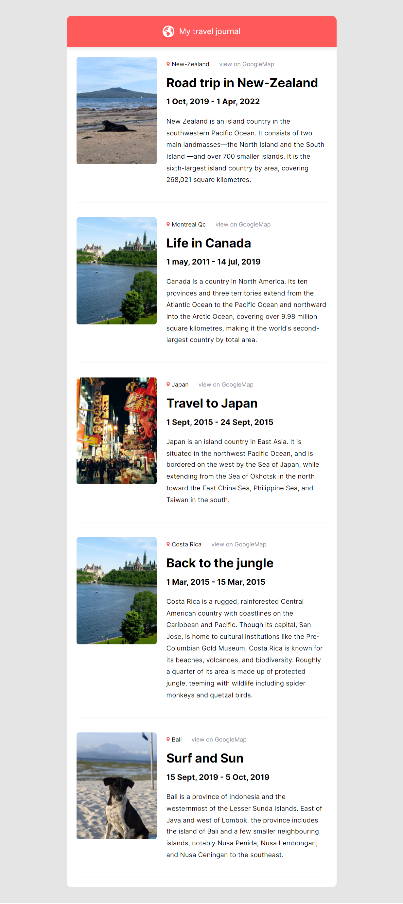

# react travel journal

The project is to build a one page travel journal that shows my last travels. It is a static website using react components and grabbing data from a local data file.
It is bootstraped with Vite.js.

🔗 **Live preview:** [here](https://iridescent-chimera-89557b.netlify.app/)

### Screenshot

## Built with

### Technologies

- HTML
- CSS
- React JS

### Tools

- Vite

## Features

- Simple one page app with static content

## What I learned

- Better knowledge of **React** use of components and props.

## Author

👤 **Edouard Desgrée**

- GitHub: [edesgree](https://github.com/edesgree)

#### Created while working on the [The Odin Project](https://www.theodinproject.com/) and a [scrimba](https://scrimba.com/) class
